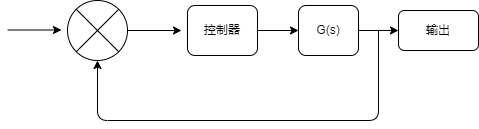

# 经典控制理论

## 概述

- **系统的稳定性的判断**，根据系统传递函数的**极点**，如果极点在负半平面，则系统稳定。在正半面则系统发散不稳定。如果实部为0，则系统振荡(B站，自控原理，第二节稳定性分析与极点)。当得到一个系统的传递函数之后，可以给系统施加一个冲击函数，再来观察系统的响应。这个时候系统的响应如果是趋于稳定，则说明系统稳定。发散则说明系统不稳定。冲击函数的拉普拉斯变换为1。也就是开头所说的，研究系统的传递函数就能得到系统的稳定性。**如果一个系统不稳定，对于经典控制，就需要我们想办法使系统的传递函数的极点落在负半平面。
**

## 数学建模

### 动态方程

- #### "弹簧质量阻尼"系统

    弹簧阻尼系统的动态方程可以用二阶常微分方程表示。假设系统质量为$m$，弹簧的刚度为$k$，阻尼系数为$c$，位移为$x(t)$，则该系统的动态方程为：

    $$ m \frac{d^2x}{dt^2} + c \frac{dx}{dt} + kx = F(t) $$

    其中，$F(t)$ 表示外力。

- #### 传递函数
  
要对给定的动态方程进行拉普拉斯变换，可以使用拉普拉斯变换的线性性质和微分性质。首先，将动态方程写为拉普拉斯域中的形式，然后使用拉普拉斯变换表找到每一项的变换。\
首先，对方程两边进行拉普拉斯变换：

$$ m \mathcal{L} \left\{ \frac{d^2x}{dt^2} \right\} + c \mathcal{L} \left\{ \frac{dx}{dt} \right\} + k \mathcal{L} \{ x \} = \mathcal{L} \{ F(t) \} $$

根据拉普拉斯变换的微分性质，我们有：

$$ m (s^2 X(s) - s x(0) - \dot{x}(0)) + c (s X(s) - x(0)) + k X(s) = F(s) $$

  其中，$X(s)$ 是 $x(t)$ 的拉普拉斯变换。然后，整理方程，将 $X(s)$ 的项放在一起：

$$ X(s) (ms^2 + cs + k) = ms x(0) + (m + c) \dot{x}(0) + F(s) $$

  最终，将 $X(s)$ 表示出来：

$$ X(s) = \frac{ms x(0) + (m + c) \dot{x}(0) + F(s)}{ms^2 + cs + k} $$

   这就是给定动态方程的拉普拉斯变换形式。

$$
X(s) = \frac{1}{ms^2 + cs + k}
$$

将其化简为标准形式：

$$
\begin{align*}
X(s) &= \frac{1}{ms^2 + cs + k} \\
&= \frac{1}{m} \cdot \frac{1}{s^2 + \frac{c}{m}s + \frac{k}{m}}
\end{align*}
$$

标准形式的分母通常是 $s^2 + 2\zeta \omega_n s + \omega_n^2$，其中 $\zeta$ 是阻尼比， $\omega_n$ 是自然频率。

比较给定的分母 $s^2 + \frac{c}{m}s + \frac{k}{m}$ 和标准形式的分母，可以得到：

$$
\begin{align*}
2\zeta \omega_n &= \frac{c}{m} \\
\omega_n^2 &= \frac{k}{m}
\end{align*}
$$

解出 $\zeta$ 和 $\omega_n$ 并将其代入标准形式，得到：

$$
\begin{align*}
\zeta &= \frac{c}{2m\omega_n} \\
\omega_n &= \sqrt{\frac{k}{m}}
\end{align*}
$$

将 $\omega_n$ 代入第一个式子，得到：
$$
\zeta = \frac{c}{2m} \cdot \frac{1}{\sqrt{\frac{k}{m}}} = \frac{c}{2\sqrt{km}}
$$

因此，标准形式的分母为：
$$
s^2 + 2 \cdot \frac{c}{2\sqrt{km}} \cdot \sqrt{\frac{k}{m}} s + \left(\sqrt{\frac{k}{m}}\right)^2
$$

$$
s^2 + 2 \zeta \omega_n s + \omega_n^2
$$

将其代入标准形式，即可得到化简后的传递函数。

## 相关分析

<svg xmlns="http://www.w3.org/2000/svg" xmlns:xlink="http://www.w3.org/1999/xlink" version="1.1" width="479px" height="129px" viewBox="-0.5 -0.5 479 129" content="&lt;mxfile&gt;&lt;diagram id=&quot;XeLIp_fA9nOq3fn8DNiB&quot; name=&quot;第 1 页&quot;&gt;zVdNj5swEP01ltpLBeH7mGRpeqm6Ug7dPbrgBauAkTGbpL++JgwBY7KgbtTNJfI87PHMe+Oxg6xtftxxXKbfWUwytDLiI7Ie0GrlmIH8bYATALbXAgmncQuZPbCnfwiABqA1jUmlTBSMZYKWKhixoiCRUDDMOTuo015Ypu5a4oRowD7CmY7+pLFIW9RfeT3+jdAk7XY2XUg4x91kyKRKccwOA8gKkbXljIl2lB+3JGu463hp13298vUSGCeFWLJg1S54xVkNuUFc4tQlK0Msm2FV52GWSYqlsSkJpzkRhMsPpEUfe2hzSKkg+xJHzcKDrAGJpSLPpGXK4S8c/U44q4v4Ry0yWhDA9eghoVfCBTkOIMhmR5jckp/kFPhq2UA1lJZpA9OHXigXoHSgUYdhKI3k4rlnTw6AwGkyrXkySRGvmwKUVpThqqKRygw5UvE0GD/LsfHFAeuhSdLojBMYV1mrWM0joghNYqWydRoHNDkTNHUYJxkW9FU9D1PcwQ6PjMrgLirZhqWodPHbuWhDh1XD+h07clVHpjdyJDBPiNAcnaW8pL1IXfvO1L0TKVf+6MC5gczon8S0bGvO1e3k9BbIKRneg1mwpksNxVx07CD8NmzoNAvlW6zL0vbk6BmHLvJDtPZQ6CDfRxu3GQQBWvsaGed2TWJIfqbB36CR2+64kTtaI/feKOv3MBX8l9pw9drwP6o2XC3j3afq84cXgeMbs0UwdZvfogj8ieMij0iIAut8XDy0WWsEzVCi8ncDgtwxQY7+3PEnCLJvQFD3Gn/XjVjITZ/6a7Axn4ff+kvxbM3eisPTdF9vHtcdSTV+qiy+JkeOtLfrlUtSCoFPg2llM6FaHnC3z9W4vOCt+XLQRrDwxpZm/z+ond7/mbTCvw==&lt;/diagram&gt;&lt;/mxfile&gt;"><defs/><g><ellipse cx="97" cy="30" rx="30" ry="30" fill="rgb(255, 255, 255)" stroke="rgb(0, 0, 0)" pointer-events="all"/><path d="M 75.7 8.7 L 118.3 51.3" fill="none" stroke="rgb(0, 0, 0)" stroke-miterlimit="10" pointer-events="all"/><path d="M 118.3 8.7 L 75.7 51.3" fill="none" stroke="rgb(0, 0, 0)" stroke-miterlimit="10" pointer-events="all"/><path d="M 127 30 L 174.63 30" fill="none" stroke="rgb(0, 0, 0)" stroke-miterlimit="10" pointer-events="stroke"/><path d="M 179.88 30 L 172.88 33.5 L 174.63 30 L 172.88 26.5 Z" fill="rgb(0, 0, 0)" stroke="rgb(0, 0, 0)" stroke-miterlimit="10" pointer-events="all"/><path d="M 7 29.5 L 54.63 29.5" fill="none" stroke="rgb(0, 0, 0)" stroke-miterlimit="10" pointer-events="stroke"/><path d="M 59.88 29.5 L 52.88 33 L 54.63 29.5 L 52.88 26 Z" fill="rgb(0, 0, 0)" stroke="rgb(0, 0, 0)" stroke-miterlimit="10" pointer-events="all"/><path d="M 257 30 L 291.63 30" fill="none" stroke="rgb(0, 0, 0)" stroke-miterlimit="10" pointer-events="stroke"/><path d="M 296.88 30 L 289.88 33.5 L 291.63 30 L 289.88 26.5 Z" fill="rgb(0, 0, 0)" stroke="rgb(0, 0, 0)" stroke-miterlimit="10" pointer-events="all"/><rect x="187" y="5" width="70" height="50" rx="7.5" ry="7.5" fill="rgb(255, 255, 255)" stroke="rgb(0, 0, 0)" pointer-events="all"/><g transform="translate(-0.5 -0.5)"><switch><foreignObject pointer-events="none" width="100%" height="100%" requiredFeatures="http://www.w3.org/TR/SVG11/feature#Extensibility" style="overflow: visible; text-align: left;">

控制器

</foreignObject><text x="222" y="34" fill="rgb(0, 0, 0)" font-family="Helvetica" font-size="12px" text-anchor="middle">控制器</text></switch></g><path d="M 358 30 L 391.63 30" fill="none" stroke="rgb(0, 0, 0)" stroke-miterlimit="10" pointer-events="stroke"/><path d="M 396.88 30 L 389.88 33.5 L 391.63 30 L 389.88 26.5 Z" fill="rgb(0, 0, 0)" stroke="rgb(0, 0, 0)" stroke-miterlimit="10" pointer-events="all"/><rect x="298" y="5" width="60" height="50" rx="7.5" ry="7.5" fill="rgb(255, 255, 255)" stroke="rgb(0, 0, 0)" pointer-events="all"/><g transform="translate(-0.5 -0.5)"><switch><foreignObject pointer-events="none" width="100%" height="100%" requiredFeatures="http://www.w3.org/TR/SVG11/feature#Extensibility" style="overflow: visible; text-align: left;">

G(s)

</foreignObject><text x="328" y="34" fill="rgb(0, 0, 0)" font-family="Helvetica" font-size="12px" text-anchor="middle">G(s)</text></switch></g><rect x="398" y="10" width="80" height="40" rx="6" ry="6" fill="rgb(255, 255, 255)" stroke="rgb(0, 0, 0)" pointer-events="all"/><g transform="translate(-0.5 -0.5)"><switch><foreignObject pointer-events="none" width="100%" height="100%" requiredFeatures="http://www.w3.org/TR/SVG11/feature#Extensibility" style="overflow: visible; text-align: left;">

输出

</foreignObject><text x="438" y="34" fill="rgb(0, 0, 0)" font-family="Helvetica" font-size="12px" text-anchor="middle">输出</text></switch></g><path d="M 378 30 L 378 110 Q 378 120 368 120 L 107 120 Q 97 120 97 110 L 97 66.37" fill="none" stroke="rgb(0, 0, 0)" stroke-miterlimit="10" pointer-events="stroke"/><path d="M 97 61.12 L 100.5 68.12 L 97 66.37 L 93.5 68.12 Z" fill="rgb(0, 0, 0)" stroke="rgb(0, 0, 0)" stroke-miterlimit="10" pointer-events="all"/></g><switch><g requiredFeatures="http://www.w3.org/TR/SVG11/feature#Extensibility"/><a transform="translate(0,-5)" xlink:href="https://www.diagrams.net/doc/faq/svg-export-text-problems" target="_blank"><text text-anchor="middle" font-size="10px" x="50%" y="100%">Text is not SVG - cannot display</text></a></switch></svg>

